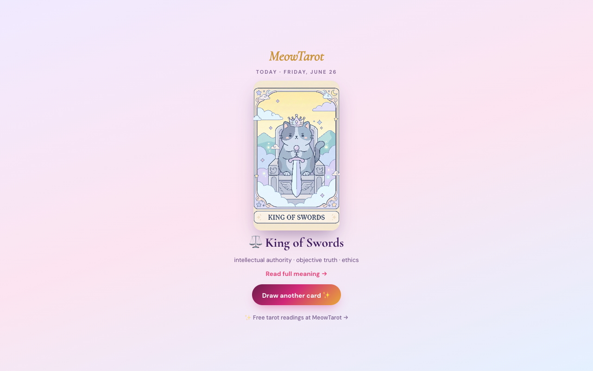

# MeowTarot — Free Tarot Widget, WordPress Plugin & New-Tab Extension

Open-source embeds for [**MeowTarot**](https://www.meowtarot.com) — a free, cute,
cat-themed tarot reader in **English & Thai**.

Drop a tarot card draw onto any website, any WordPress site, or your browser's new-tab
page. All three share the same 78-card deck and link through to the full readings on
[meowtarot.com](https://www.meowtarot.com).



---

## What's inside

### 1. Embeddable widget — [`widget.html`](widget.html)

A single, dependency-free HTML page you can `iframe` anywhere. Pick a spread, draw, and
each card links to its full meaning on MeowTarot.

Live page: <https://www.meowtarot.com/widget.html> · Copy-paste builder:
<https://www.meowtarot.com/widgets/>

```html
<iframe src="https://www.meowtarot.com/widget.html"
        width="340" height="600" loading="lazy"
        style="border:0;border-radius:18px" title="Free Tarot Draw by MeowTarot"></iframe>
```

Options (query string): `?spread=three` (Past · Present · Future), `?lang=th` (Thai —
or use [`th/widget.html`](th/widget.html)).

### 2. WordPress plugin — [`wordpress-plugin/`](wordpress-plugin/)

Adds the widget via a shortcode `[meowtarot_tarot]`, a Gutenberg block, or a classic
sidebar widget. English & Thai, with an **optional** (off-by-default) attribution link.

Install the packaged [`meowtarot-widget.zip`](wordpress-plugin/meowtarot-widget.zip) via
**Plugins → Add New → Upload Plugin**, or find it on the
[WordPress.org plugin directory](https://wordpress.org/plugins/meowtarot-tarot-widget/).

### 3. Chrome new-tab extension — [`chrome-extension/`](chrome-extension/)

Replaces your new-tab page with a **daily cat-tarot card** (a deterministic card of the
day, plus a free pull whenever you want one). No account, no data collection.

Load it unpacked via `chrome://extensions` → *Load unpacked*, or install from the Chrome
Web Store (link coming once it's live).

---

## About MeowTarot

[MeowTarot](https://www.meowtarot.com) is a free bilingual (EN/TH) cat-themed tarot app:
daily readings, a Past · Present · Future spread, the full 10-card Celtic Cross, and a
collectible cat-art deck. No sign-up required to read.

- 🌐 Web app: <https://www.meowtarot.com>
- 🃏 Card meanings: <https://www.meowtarot.com/cards/>
- 🧩 Embed builder: <https://www.meowtarot.com/widgets/>

## License

[MIT](LICENSE) for the widget and Chrome extension. The `wordpress-plugin/` folder is
**GPL-2.0-or-later** (as required for WordPress.org), per the license headers in that
folder. Cat art and the MeowTarot name/brand are © MeowTarot and not covered by the code
license.
